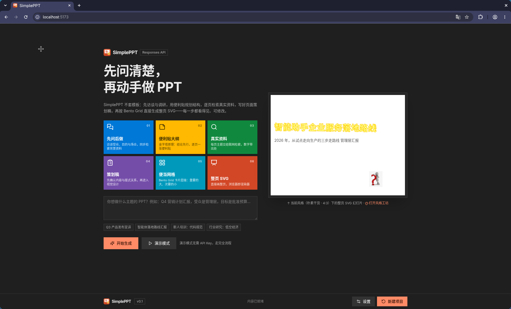
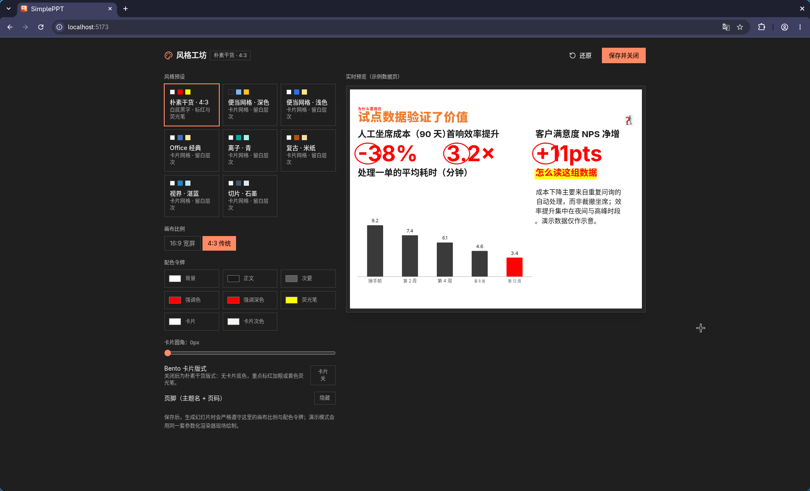
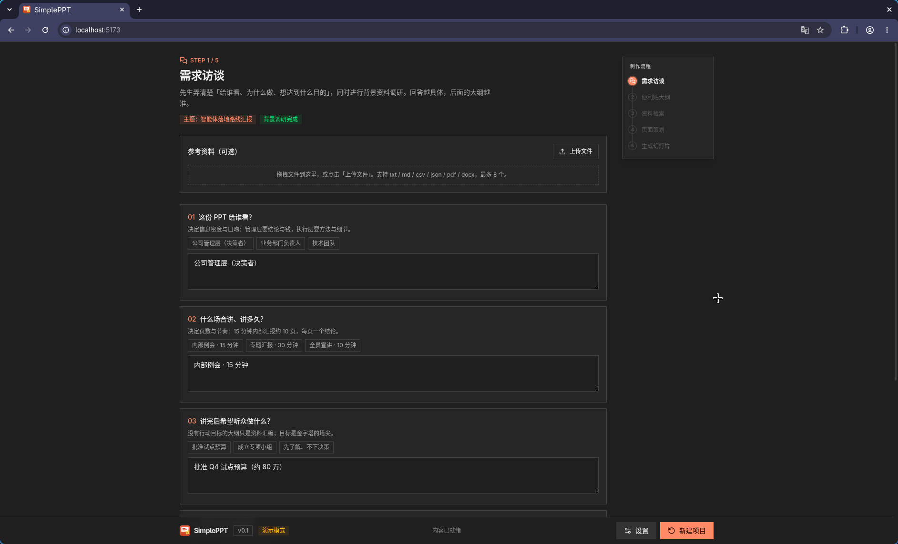
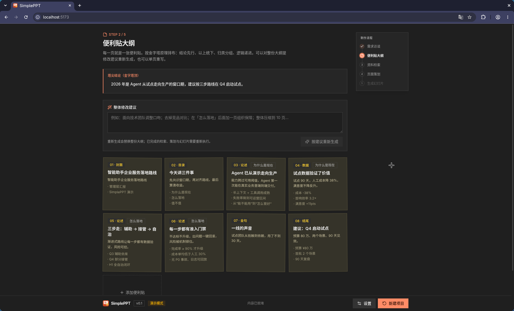
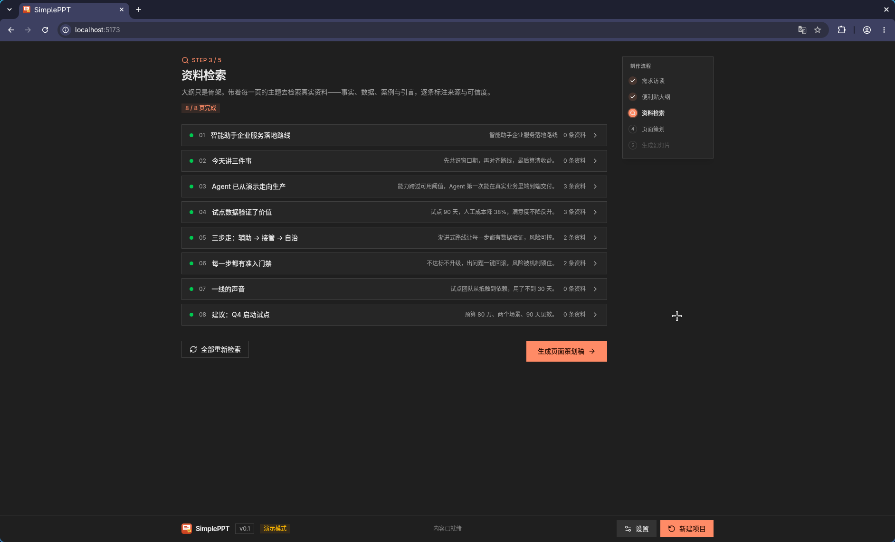
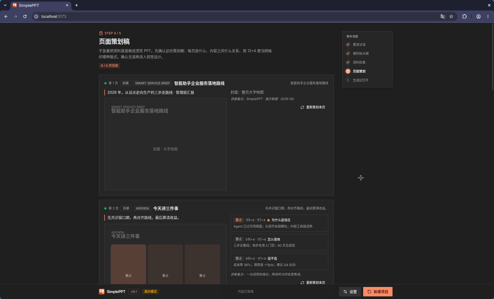
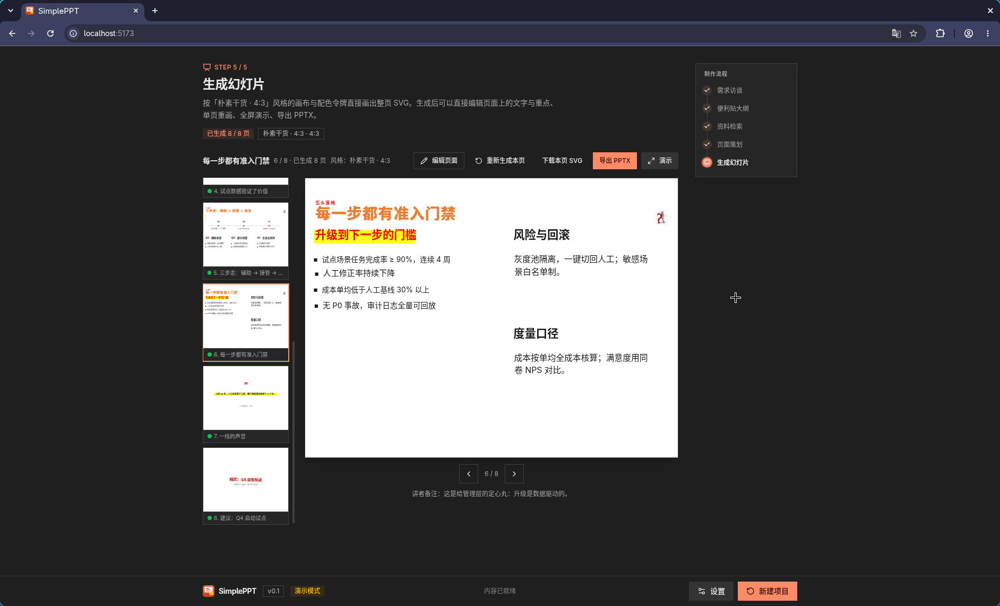

<p align="center">
  
</p>

<h1 align="center">SimplePPT</h1>

<p align="center">
  
  
  
  
  
</p>

<p align="center">
  <a href="https://simpleppt.pages.dev" target="_blank" rel="noreferrer">
    
  </a>
</p>

**先问清楚，再动手做 PPT** —— 一个可视化的 PPT 自动生成网页应用。

不套模板：先访谈与调研，用「便利贴法」规划结构，逐页检索真实资料，写好页面策划稿，再按 Bento Grid（便当网格）**直接生成整页 SVG**。全程在浏览器里可视化预览、修改、演示与导出。

[截图](#截图)

## 快速开始

```bash
npm install
npm run dev        # http://localhost:5173
```

打开 <http://localhost:5173>：

- **演示模式**：无需 API Key，点「演示模式」即可用内置示例数据走模拟完全流程（含 8 页示例幻灯片、导出 PPTX）。
- **真实生成**：「设置」里填写 API Base URL / API Key / 模型名，然后输入主题开始。

生产模式：

```bash
npm run build
npm run preview    # 本地预览构建产物
```

部署到 Cloudflare Pages 时，把 `dist/` 与仓库根目录的 `functions/` 一起发布：Pages Functions 会自动提供同源 `/api/proxy`，浏览器里发往模型/搜索接口的出站请求都由它转发，避开跨域限制（Git 集成会自动识别 `functions/`；手动上传请用 `wrangler pages deploy dist --project-name <项目名>`）。

## AI API

生成能力全部在浏览器本地执行（只支持 Responses 格式，`POST {baseUrl}/responses`）。出站请求经同源 `/api/proxy` 转发，因此无需模型网关开放浏览器跨域；API Key 只保存在本机浏览器，并随请求发送到你自己的 Pages Function。

## 生成流水线（严格遵循六步思路）

| 步骤 | 界面 | 做什么 |
|---|---|---|
| 1. 先提问，再生成 | **需求访谈** | AI 提 4-5 个澄清问题（给谁看 / 为什么做 / 想达到什么目的），**同时**后台做背景资料调研 |
| 2. 便利贴法规划结构 | **便利贴大纲** | 每页一张数字便利贴，金字塔原理组织：结论先行、以上统下、归类分组、逻辑递进；可编辑 / 增删 / 调序 |
| 3. 大量检索真实资料 | **资料检索** | 搜集事实、数据、案例与引言，逐条标注来源与可信度 |
| 4. 策划稿中间层 | **页面策划稿** | 不让 AI 拿到资料直接做漂亮 PPT——先产出每页策划稿：放什么内容、内容什么关系、用 12×4 便当网格的哪种版式，附版式示意图 |
| 5. Bento Grid | （内置于策划与生成） | 重要内容大卡片、次要内容小卡片，用尺寸与留白形成层次 |
| 6. 直接生成整页 SVG | **生成幻灯片** | AI 根据策划稿的**精确卡片矩形**直接画出完整 SVG（1280×720，无模板）；浏览器内做 XML 校验，失败自动带错误重试（最多 3 次） |

每一步都可回到上一步重做，单页可单独重新策划 / 重新生成。

## 导出与演示

- **可编辑 PPTX**：SVG 逐元素还原成 Office 原生形状与文本框（不垫底图），讲者备注一并写入
- **讲稿 Markdown**：「生成幻灯片」页一键导出 `.md` 讲稿（核心结论、每页一句话信息、讲者备注），方便排练
- **项目备份**：底栏「设置 → 项目」可把当前项目（访谈、大纲、资料、策划稿与幻灯片）导出成一个 JSON 文件，随时导入恢复，换浏览器 / 换设备不丢
- **演示者视图**：放映时右上角计时，`N` 呼出讲者备注；空格 / ←→ 翻页，Esc 退出

## 截图








